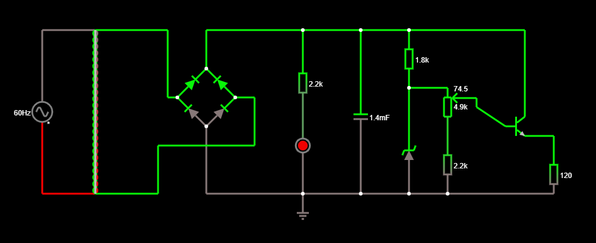
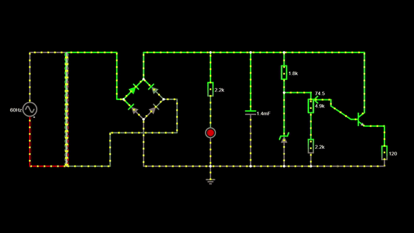
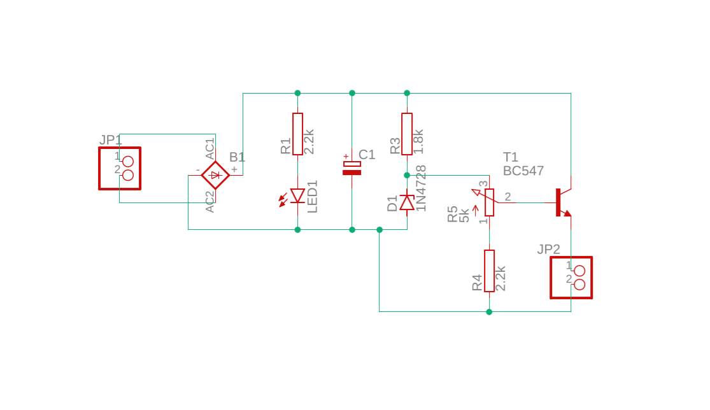
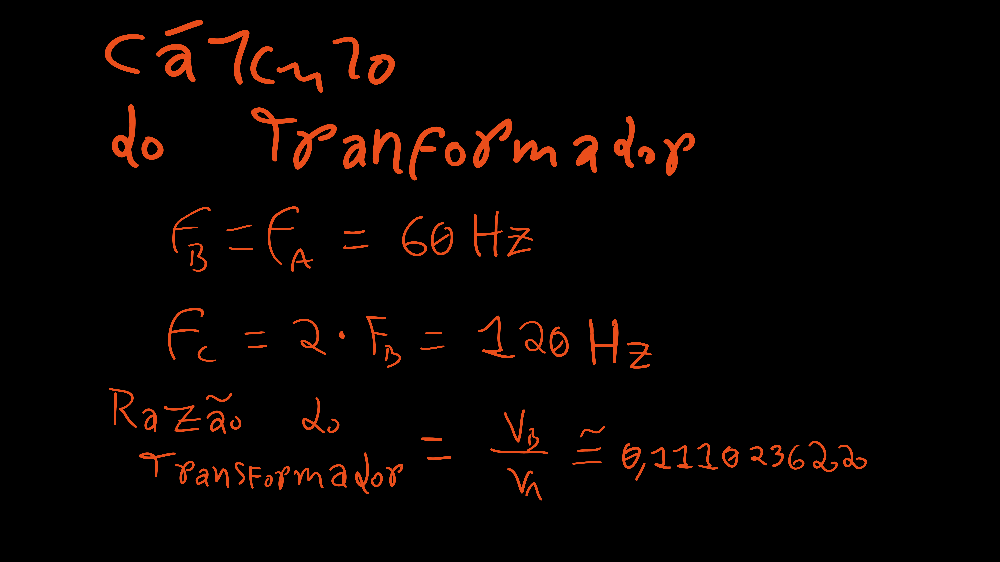
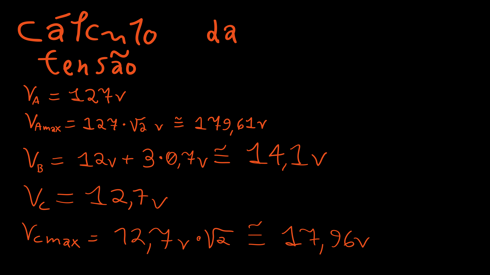
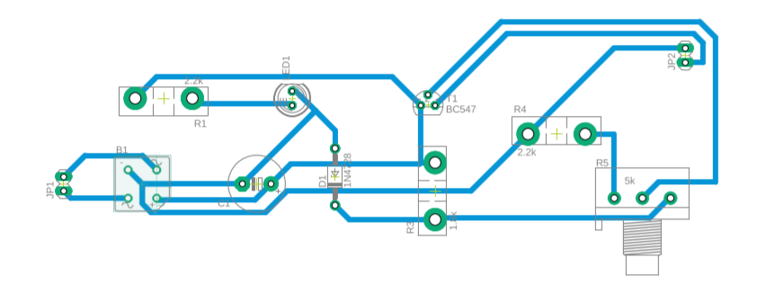

# FONTE DE TENSÃO AJUSTÁVEL
### Um projeto desenvolvido para a disciplina de Eletrônica para a Computação da USP 
> Neste projeto, busca-se projetar uma fonte de tensão ajustável entre 3v e 12v, com uma corrente de 100mA. Ela deve ser capaz de receber uma corrente alternada de tensão eficaz de 127v e fornecer uma corrente contínua. 

  

## Circuito no Falstad
#### Circuito Estático

 
#### Simulação

   

## Circuito no Eagle

  

## Escolha dos Componentes
<table>
  <tr>
    <th>Nome do Componente</th>
    <th>Especificação</th>
    <th>Preço</th>
  </tr>
  <tr>
    <td>Capacitor Eletrolítico</td>
    <td>470uF / 25V</td>
    <td><a href="https://www.eletrogate.com/capacitor-eletrolitico-470uf-x-25v">R$ 0,35</a></td>
  </tr>
  <tr>
    <td>Capacitor Eletrolítico</td>
    <td>1000uF / 25V</td>
    <td><a href="https://www.eletrogate.com/capacitor-eletrolitico-1000uf-x-25v">R$ 0,90</a></td>
  </tr>
  <tr>
    <td>Diodo Zener BZX55C</td>
    <td>13V / 0.5W</td>
    <td><a href="https://www.baudaeletronica.com.br/diodo-zener-bzx55c-13v-0-5w.html">R$ 0,08</a></td>
  </tr>
  <tr>
    <td>Led Difuso Amarelo</td>
    <td>5mm</td>
    <td><a href="https://www.eletrogate.com/led-difuso-5mm-amarelo">R$ 0,30</a></td>
  </tr>
  <tr>
    <td>Potenciômetro Linear</td>
    <td>5kΩ</td>
    <td><a href="https://www.baudaeletronica.com.br/potenciometro-linear-de-5k-5000.html">R$ 1,99</a></td>
  </tr>
  <tr>
    <td>Resistor</td>
    <td>1kΩ / 0.5W</td>
    <td><a href="https://www.baudaeletronica.com.br/resistor-1k0-1-2w.html">R$ 0,14</a></td>
  </tr>
  <tr>
    <td>Resistor</td>
    <td>2kΩ / 0.5W</td>
    <td><a href="https://www.baudaeletronica.com.br/resistor-2k0-1-2w.html">R$ 0,14</a></td>
  </tr>
  <tr>
    <td>Resistor</td>
    <td>120Ω / 2W</td>
    <td><a href="https://www.baudaeletronica.com.br/resistor-120r-5-2w.html">R$ 0,38</a></td>
  </tr>
  <tr>
    <td>Resistor</td>
    <td>470Ω / 2W</td>
    <td><a href="https://www.baudaeletronica.com.br/resistor-470r-5-2w.html">R$ 0,38</a></td>
  </tr>
  <tr>
    <td>Transistor NPN</td>
    <td>100v / 6A</td>
    <td><a href="https://www.eletrogate.com/transistor-npn-tip41c">R$ 2,90</a></td>
  </tr>
  <tr>
    <td>Transformador</td>
    <td>15v / 800mA</td>
    <td><a href="https://produto.mercadolivre.com.br/MLB-1951118562-transformador-trafo-15-15v-800ma-110220v-_JM#position=1&search_layout=stack&type=item&tracking_id=958caf5b-0357-476b-b250-410b91656d9c">R$ 38,99</a></td>
  </tr>
  <td>Ponte Retificadora</td>
    <td>1000v / 10A</td>
    <td><a href="https://www.baudaeletronica.com.br/ponte-retificadora-kbpc1010.html">R$ 3,67</a></td>
  </tr>
</table>

  

## Componentes
#### Ponte de Diodods
> * Esse componente pode ser feito com 4 diodos, porém é mais fácil comprá-lo pronto. Sua função é garantir que a corrente apenas flua em um sentido. Ela segue sendo alternada, porém não 'desce' abaixo do 'zero'. 
> * No gráfico, ela funciona como se fosse um módulo. Ou seja, quando aplicada em uma corrente alternada (senoide), ela 'joga' os pontos 'negativos' para o 'positivo'.

#### Capacitor
> * O capacitor serve para armazenar temporariamente uma certa carga durante um periodo de auta crescente da tensão e descarrega no período subsequente. Assim, ele serve para "atenuar" a queda da tensão, mantendo a tensão máxima inalterada, porém elevando a tensão máxima. 
> * Idealmente, se previa um capacitor com uma capacitância de aproximadamente 1,4 mF, que se trata de um valor comercial segundo o Falstad. Entretanto, por ser difício de encontrar, um bom substituto são dois capacitores ligados em paralelo de 1mF e 470uF (listados acima).

#### Zenner
> * Serve para 'filtrar' o excesso de corrente. Escolhe-se um valor abaixo da tensão mínima no ponto C (considerando o capacitor) para assim eliminar ou mitigar o ripple - isto é, tornar a corrente de fato contínua. 
> * A potência máxima do diodo zener escolhido é bem mais elevada do que o necessário segundo os cáculos (0.5w > 0.0137W), o que garante uma margem de segurança agradável.

#### Led
> * Apenas serve para indicar a passagem de corrente para o usuário. Se trata de um componente facultativo.

#### Potenciômetro Linear
> * Serve para regular a voltagem que passará pelo transistor. Dessa forma, é possível ajustar a tensão de acordo com o dispositivo conectado (entre 3v e 12v).

#### Resistores
> * Servem para limitar a quantidade de corrente que passam pelo circuito. 
> * Os valores das resistencias foram aproximados para valores comerciais. Entretanto, estes resistores ainda são um pouco difíceis de se achar. Assim, uma alternativa e comprar resistores mains comuns e assossia-los de modo que a resistência equivalente seja aproximadamente igual ao modelo inicialmente planejado.
> * (1.8k ≅ 1k + 0.5k), (2.2k ≅ 2k).

#### Transistor NPN
> * Serve para ajustar de fato a corrente que será alimentada ao dispositivo. Ele aplifica a corrente sem exigir que uma grande corrente passe pelo resistor ligado ao zener. 
> * É a resposta para: como é possível ter um resistor grande o suficiente para evitar que o zener queime e pequeno o bastante para alimentar o dispositivo com a corrente necessária? Simples, com um transistor NPN.
> * Um 'defeito' natural desse tipo de transistor é que ele não pode passar mais tensão do que a tensão da base - 0.7. Porém, nesse caso, isso é uma vantagem, pois mesmo com uma corrente muito pequena, a base do transistor será capaz de estabelecer uma tensão máxima. 

  

## Cálculos
#### Imagem de Referência
> Note que o resistor R5 não faz parte do circuito, pois ele apenas representa a resistência do dispositivo que será conectado à fonte.

#### Calculando a razão do transformador

#### Calculando a tensão equivalente do dispositivo

#### Calculando as tensões

#### Calculando as correntes e potências
> É importante escolher componentes que suportem as potências máximas previstas (e um pouco mais, por segurança).

#### Calculando a Capacitância do Capacitor

  

## Circuito alternativo
> * Como algumas das peças escolhidas são mais difícies de se encontrar, o seguinte circuito no Falstad serve como uma alternativa ao primeiro com valores mais aproximados. Vale destacar que é bem melhor usar o valor 1.5kΩ ao invés de 2kΩ para o resistor do zenner (embora isso signifique ter que comprar um valor diferente dos demais resistores). Note que a resistência 1.500 pode ser alcançada aproximadamente com dois resistores em serie, um de 1kΩ e outro de 470Ω (valores comerciais e comuns). 
> * Os capacitores em serie tem sua capacitância somada na capacitância equivalente.

  

## Circuito Roteado Para Impressão no Eagle
#### Com a silhueta dos componentes
> Imagem não invertida.

#### Apenas Buracos e COnexões
> Obs: Note que, nesta versão, o circuito está invertida, pois essa versão, após ser imprimida, objetiva ser referência ao se fazer a parte de baixo do circuito.

   

## Links
1) <h4><a href="https://tinyurl.com/yglzjbnm">Circuito no Falstad</a></h4>
2) <h4><a href="https://youtu.be/UzgwbXbtjCQ">Vídeo explicando o circúito resumidamente</a></h4>
3) <h4><a href="https://youtu.be/bB7XH8SxTIc">Link 2 para o vídeo</a></h4>

 

## Autor do Prjeto
Bernardo Maia Coelho, aluno do curso de Bacharelado de Ciências de Computação do Instituto De Ciências Matemáticas e de Computação (ICMC - USP).

 

## Prosfessor Orientador
Eduardo do Valle Simoes

 
